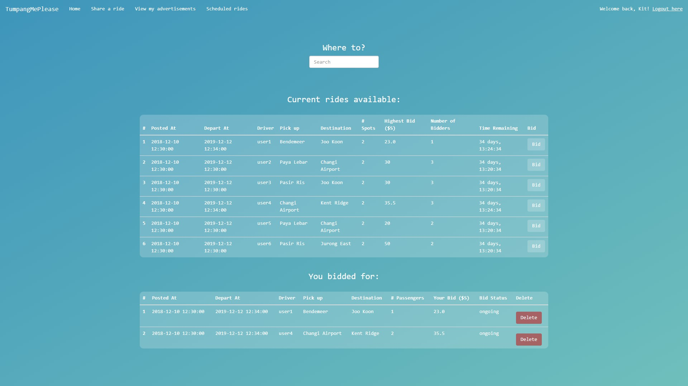
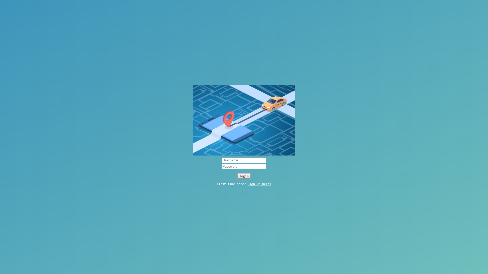

# Tumpang Me Please! 



# Pre-requisites
Ensure that you have the following installed:
1. PostgreSQL
2. Python 3.5 (and above)
3. Google Chrome (other browsers may not be supported)

# Setup Guide

1. Clone the files from its github repo [here](https://github.com/DriverUncle/TumpangMePlease.git). Clone the repo to your desired directory.
2. Open a terminal, set the directory to the cloned repo, then run the following command to install the dependencies: 
   -  for pip: `pip install -r requirements.txt`
   -  for conda: `conda install --file requirements.txt`
3. In the terminal,  launch PostgreSQL, and load the data from `/init.sql` into the database.
4. In the file `FlaskApp/app.py`, ensure that the login details match the existing ones in your PostgreSQL.
```python
# Config
app.config['SQLALCHEMY_DATABASE_URI'] = 'postgresql://{username}:{password}@{host}:{port}/{database}'\
    .format(
        username='postgres', # Your PostgreSQL username here
        password='password', # Your Password here
        host='localhost',
        port=5432,
        database='postgres'
    )
app.config['SECRET_KEY'] = 'A random key to use CRF for forms'
```

> **Note:** Replace `<username>`, `<password>`, `<port>`, and `<database_name>` with  the actual configuration from your database.
> If you are not sure about `<port>` and don't recall changing such a value during initial setup or launching of PostgreSQL server, then it should be `5432` by default.

5. In the terminal, set the directory to the cloned repo, then run the following command to start the development server: `python FlaskApp/app.py`
6. In chrome, type the following address `http://localhost:5000/` to launch the app. <br>You should see some messages showing up in your terminal, with these last few lines:
```
 * Debugger is active!
 * Debugger PIN: 215-554-995
 * Running on http://localhost:5000/ (Press CTRL+C to quit)
```

There may be warnings for SQLAlchemy but you can ignore those.

Go back to `app.py` file and observe the following lines:

```
if __name__ == "__main__":
    app.run(
        debug=True,
        host='localhost',
        port=5000
    )
```

These few lines define the host and port to run the web server.
If you change the port number to `5001`, the message shown at earlier stage will be changed accordingly.
For this walk-through (and also the CS2102 project), there is no need to change these settings.

To access the web server, open your favorite web browser (Chrome, Firefox, IE, etc) and enter `localhost:5000/` in the address bar.

Press `Enter` then the page below should show up.




Notice that `localhost:5000` comes from `app.py` setting, and the extra `/` comes from the URL routing mapping in `views.py`.
To add more web pages, you need to add routing to the new page in `views.py` and provide a function that renders the page to show when the URL is accessed.
Most likely you will need to show or render `html` files as web pages. To do that, you need to firstly drop the `html` file(s) into the `FlaskApp/templates` folder. 
